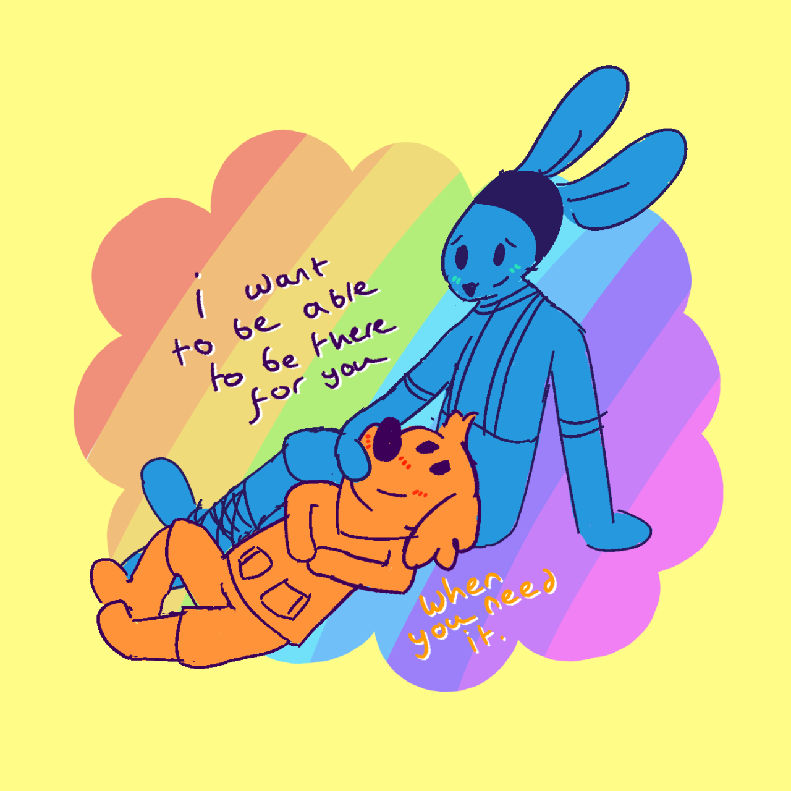

# chicory.gay

Website for [https://chicory.gay](https://chicory.gay)

## Development

Requirements:

- [Node v16+](https://nodejs.org)

Steps:

1. git clone
2. npm install
3. npm start

This should open the web app at http://localhost:5173

### Extra notes

This project used to be bootstrapped with [Create React App](https://create-react-app.dev/docs/getting-started/) but it's now migrated to [Vite](https://vitejs.dev), because of this, there are a few quirks that is normally not seen on other Vite projects:

- [Jest](https://jestjs.io) is used instead of [Vitest](https://vitest.dev) as [canvas in jsdom](https://github.com/vitest-dev/vitest/issues/740) doesn't work on Vitest
- `babel.config.js` is only used by Jest

## License

The web app is licensed under the [MPL 2.0 License](https://www.mozilla.org/en-US/MPL/2.0/).

Original image by [kez](https://azurehaiku.tumblr.com/post/681788441393037312/i-want-what-they-have).

Brush stamp by [moonberrytea](https://moonberrytea.tumblr.com).
